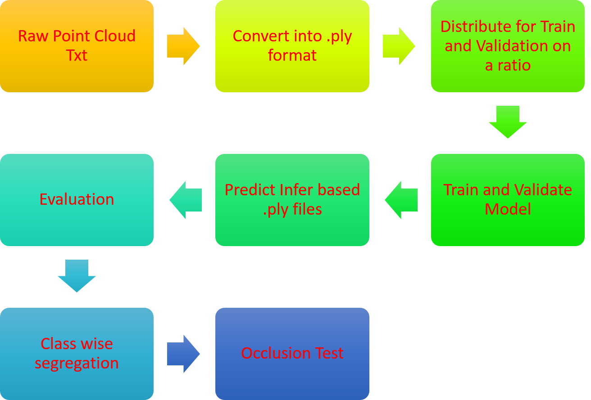

# 3D PointNet++ for Construction Progress Monitoring (CPU-Only)

This repository implements **PointNet++** for semantic segmentation of 3D point clouds in the context of **construction progress monitoring**.  
It aims to automate monitoring when up-to-date BIM models are not available, by using real-time point cloud data (from LiDAR, CCTV, drones, etc.) as a **pseudo-BIM** substitute.

---

## 📌 Project Context

Construction projects often lack reliable and updated BIM models, which makes manual progress tracking costly and inefficient.  
3D point clouds provide an alternative by capturing as-built conditions. This project demonstrates an **automation pipeline using PointNet++** to segment building elements from point cloud data, supporting real-time progress monitoring.  

Target audience: **researchers, industry engineers, and PhD advisors** interested in computer vision and construction management.

---

## ✨ Features

- CPU-only implementation of **PointNet++ (SSG)** for semantic segmentation.  
- Supports **XYZ** or **XYZ+RGB** features.  
- Automatic **train/validation split (80:20)** from raw S3DIS dataset.  
- Tracks progress via **OA, mAcc, mIoU** metrics.  
- Checkpointing (`last_model.pth`, `best_model.pth`) and logging (`history.json`, `train_log.json`).  
- Preprocessing scripts to convert **S3DIS annotations → PLY files**.  

---

## 📂 Dataset Information

- Dataset: [Stanford Large-Scale 3D Indoor Spaces (S3DIS)](https://cvg-data.inf.ethz.ch/s3dis/)  
- Format: RGB-D point clouds → converted to `.ply`.  

---

## ⚙️ Requirements

## 🔄 Pipeline Overview



## 🚀 Usage

#All the executable commands are written in the folder named 

---

## 📁 Folder Structure

```
├── s3dis_annots_to_ply_general.py    # Convert S3DIS txt → PLY
├── make_splits_3dis.py               # Train/val split (80:20)
├── train_eval_pointnet2_cpu.py       # Training + evaluation
├── infer_pointnet2_cpu.py            # Inference on new data
├── eval_list.py                      # Eval on batch against ground truth on validation list
├── export_class_views_cpu.py         # Export class views
├── occlusion_eval_cpu.py             # Occlusion evaluation
├── .venv/                            # Virtual environment
├── class_views/                      # Subset views (hallway, etc.)
├── out_ply/                          # Processed PLYs by area
├── results/                          # Predictions + CSV exports
└── runs/
    └── seg_cpu/
        ├── checkpoints/
        │   ├── best_model.pth
        │   └── last_model.pth
        ├── history.json
        └── train_log.json
```

---

## 📊 Results

- Training loss decreased **1.92 → 1.30** across 12 epochs.  
- Training metrics improved: **OA 0.425 / mIoU 0.092 → OA 0.625 / mIoU 0.251**.  
- Validation metrics (evaluated every 2 epochs):  
  - mIoU: 0.072 (ep2) → 0.229 (ep12)  
  - OA: 0.599 (ep12)  

---

## 🏗️ Applications in Construction

- Real-time **progress monitoring** from 3D point clouds.  
- Comparison of **as-built vs BIM models** (or pseudo-BIM).  
- Detecting **installed vs missing elements** on site.  
- Compatible with data from **LiDAR, CCTV, drones**.  

---

## 🔮 Next Steps / TODO

- Multi-modal fusion (point cloud + CCTV/drone imagery).  
- Training on Larger-scale datasets with more epochs and dynamic learning rate.  
- GPU support for faster training.  
- Explainability (Grad-CAM, attention maps).  

---

## 📚 Citation & Credits
- Qi, C. R., Yi, L., Su, H., & Guibas, L. J. (2017). (https://arxiv.org/abs/1706.02413)
- Armeni, I., Sener, O., Zamir, A. R., Jiang, H., Brilakis, I., Fischer, M., & Savarese, S. (2016). (https://arxiv.org/abs/1607.05644)
- Zhou, Q.-Y., Park, J., & Koltun, V. (2018). {https://arxiv.org/abs/1801.09847}
- Implementation support: **GPT-5.0**
